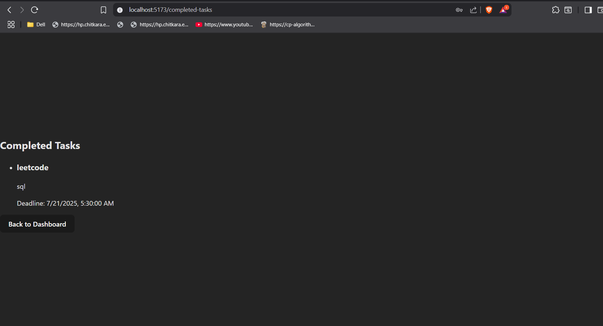

# Task Manager Application

A full-stack web application for managing tasks with user authentication, built using Django (REST API) and React (TypeScript, Vite) for the frontend.

---

## Features
- User registration and login (JWT authentication)
- Add, view, complete, and delete tasks
- **Time-Aware Auto-Bucketing**: Tasks automatically categorize into three states:
  - **Upcoming**: Tasks with future deadlines that are not yet complete
  - **Missed**: Tasks with past deadlines that were not completed
  - **Completed**: Tasks manually marked as complete by the user
- Filter tasks by Pending, Missing, and Completed using the navigation bar
- Real-time bucket summary with visual progress indicators
- Responsive, modern UI with beautiful styling
- Protected routes for authenticated users

---

## Tech Stack
- **Backend:** Django, Django REST Framework, SimpleJWT
- **Frontend:** React, TypeScript, Vite, Tailwind CSS
- **Database:** SQLite (default, can be changed)

---

## Project Structure

```
task_manager_api/
  ├── core/                # Django project settings
  ├── tasks/               # Task management app (API)
  ├── users/               # User management app (API)
  ├── manage.py            # Django entry point
  ├── db.sqlite3           # SQLite database
  ├── requirements.txt     # Python dependencies
  └── task-manager-frontend/ # React frontend
```

---

## Setup Instructions

### 1. Backend (Django API)

#### a. Install dependencies
```bash
cd task_manager_api
python -m venv venv
source venv/bin/activate  # On Windows: venv\Scripts\activate
pip install -r requirements.txt
```

#### b. Run migrations
```bash
python manage.py migrate
```

#### c. Create a superuser (optional, for admin access)
```bash
python manage.py createsuperuser
```

#### d. Start the backend server
```bash
python manage.py runserver
```

The API will be available at `http://localhost:8000/`

---

### 2. Frontend (React)

#### a. Install dependencies
```bash
cd task-manager-frontend
npm install
```

#### b. Start the frontend server
```bash
npm run dev
```

The frontend will be available at `http://localhost:5173/`

---

## Usage

1. Register a new user or log in with existing credentials.
2. Add new tasks with a title, description, and deadline.
3. **View the Auto-Bucket Summary** on the dashboard to see task distribution across Upcoming, Missed, and Completed categories.
4. View tasks filtered by Pending, Missing, or Completed using the navigation bar.
5. Mark tasks as complete or delete them as needed.
6. Use the "Back to Dashboard" button to return to the main dashboard from any page.

---

## API Documentation

All API endpoints are prefixed with `/api/`. Authentication is required for most endpoints using JWT tokens.

### Authentication Endpoints

#### 1. Register User
- **Endpoint:** `POST /api/register/`
- **Authentication:** Not required
- **Request Body:**
  ```json
  {
    "username": "john_doe",
    "email": "john@example.com",
    "password": "securepassword123"
  }
  ```
- **Response:**
  ```json
  {
    "username": "john_doe",
    "email": "john@example.com"
  }
  ```
- **Description:** Creates a new user account

#### 2. Login User
- **Endpoint:** `POST /api/login/`
- **Authentication:** Not required
- **Request Body:**
  ```json
  {
    "username": "john_doe",
    "password": "securepassword123"
  }
  ```
- **Response:**
  ```json
  {
    "access": "eyJ0eXAiOiJKV1QiLCJhbGciOiJIUzI1NiJ9...",
    "refresh": "eyJ0eXAiOiJKV1QiLCJhbGciOiJIUzI1NiJ9..."
  }
  ```
- **Description:** Authenticates user and returns JWT tokens

#### 3. Refresh Token
- **Endpoint:** `POST /api/token/refresh/`
- **Authentication:** Not required
- **Request Body:**
  ```json
  {
    "refresh": "eyJ0eXAiOiJKV1QiLCJhbGciOiJIUzI1NiJ9..."
  }
  ```
- **Response:**
  ```json
  {
    "access": "eyJ0eXAiOiJKV1QiLCJhbGciOiJIUzI1NiJ9..."
  }
  ```
- **Description:** Refreshes the access token using refresh token

### Task Management Endpoints

#### 4. Get All Tasks
- **Endpoint:** `GET /api/tasks/`
- **Authentication:** Required (Bearer token)
- **Headers:** `Authorization: Bearer <access_token>`
- **Query Parameters:**
  - `status` (optional): Filter by status (`upcoming`, `missed`, `completed`)
  - `search` (optional): Search in title and description
  - `ordering` (optional): Order by `deadline`, `created_at`
- **Response:**
  ```json
  [
    {
      "id": 1,
      "title": "Complete Project",
      "description": "Finish the task manager project",
      "deadline": "2024-01-15T10:00:00Z",
      "completed": false,
      "status": "upcoming",
      "created_at": "2024-01-10T08:00:00Z",
      "updated_at": "2024-01-10T08:00:00Z"
    }
  ]
  ```

#### 5. Get Single Task
- **Endpoint:** `GET /api/tasks/{id}/`
- **Authentication:** Required (Bearer token)
- **Headers:** `Authorization: Bearer <access_token>`
- **Response:** Single task object (same structure as above)

#### 6. Create Task
- **Endpoint:** `POST /api/tasks/`
- **Authentication:** Required (Bearer token)
- **Headers:** `Authorization: Bearer <access_token>`
- **Request Body:**
  ```json
  {
    "title": "New Task",
    "description": "Task description",
    "deadline": "2024-01-20T15:00:00Z"
  }
  ```
- **Response:** Created task object with auto-generated fields

#### 7. Update Task
- **Endpoint:** `PUT /api/tasks/{id}/` or `PATCH /api/tasks/{id}/`
- **Authentication:** Required (Bearer token)
- **Headers:** `Authorization: Bearer <access_token>`
- **Request Body:** Any task fields to update
- **Response:** Updated task object

#### 8. Delete Task
- **Endpoint:** `DELETE /api/tasks/{id}/`
- **Authentication:** Required (Bearer token)
- **Headers:** `Authorization: Bearer <access_token>`
- **Response:** `204 No Content`

#### 9. Mark Task as Complete
- **Endpoint:** `POST /api/tasks/{id}/mark_complete/`
- **Authentication:** Required (Bearer token)
- **Headers:** `Authorization: Bearer <access_token>`
- **Request Body:** Empty `{}`
- **Response:**
  ```json
  {
    "id": 1,
    "title": "Complete Project",
    "description": "Finish the task manager project",
    "deadline": "2024-01-15T10:00:00Z",
    "completed": true,
    "status": "completed",
    "created_at": "2024-01-10T08:00:00Z",
    "updated_at": "2024-01-10T08:00:00Z"
  }
  ```

### Auto-Bucketing Endpoints

#### 10. Get Bucket Counts
- **Endpoint:** `GET /api/tasks/bucket_counts/`
- **Authentication:** Required (Bearer token)
- **Headers:** `Authorization: Bearer <access_token>`
- **Response:**
  ```json
  {
    "upcoming": 5,
    "missed": 2,
    "completed": 8,
    "total": 15
  }
  ```
- **Description:** Returns count of tasks in each auto-bucket category

#### 11. Get Auto-Bucket Summary
- **Endpoint:** `GET /api/tasks/auto_bucket_summary/`
- **Authentication:** Required (Bearer token)
- **Headers:** `Authorization: Bearer <access_token>`
- **Response:**
  ```json
  {
    "upcoming": [
      {
        "id": 1,
        "title": "Future Task",
        "description": "Task with future deadline",
        "deadline": "2024-02-01T10:00:00Z",
        "completed": false,
        "status": "upcoming",
        "created_at": "2024-01-10T08:00:00Z",
        "updated_at": "2024-01-10T08:00:00Z"
      }
    ],
    "missed": [
      {
        "id": 2,
        "title": "Overdue Task",
        "description": "Task with past deadline",
        "deadline": "2024-01-05T10:00:00Z",
        "completed": false,
        "status": "missed",
        "created_at": "2024-01-01T08:00:00Z",
        "updated_at": "2024-01-01T08:00:00Z"
      }
    ],
    "completed": [
      {
        "id": 3,
        "title": "Done Task",
        "description": "Completed task",
        "deadline": "2024-01-10T10:00:00Z",
        "completed": true,
        "status": "completed",
        "created_at": "2024-01-05T08:00:00Z",
        "updated_at": "2024-01-10T08:00:00Z"
      }
    ],
    "summary": {
      "upcoming_count": 1,
      "missed_count": 1,
      "completed_count": 1,
      "total_count": 3
    }
  }
  ```
- **Description:** Returns detailed task lists for each bucket with summary statistics

### Task Object Schema

All task objects contain the following fields:

```json
{
  "id": "integer (read-only)",
  "title": "string (required)",
  "description": "string (optional)",
  "deadline": "datetime (required, ISO 8601 format)",
  "completed": "boolean (default: false)",
  "status": "string (read-only, auto-calculated)",
  "created_at": "datetime (read-only)",
  "updated_at": "datetime (read-only)"
}
```

**Status Values:**
- `"upcoming"`: Task has future deadline and is not completed
- `"missed"`: Task has past deadline and is not completed  
- `"completed"`: Task is marked as completed (regardless of deadline)

### Error Responses

All endpoints return standard HTTP status codes:

- `200 OK`: Successful GET/PUT/PATCH requests
- `201 Created`: Successful POST requests
- `204 No Content`: Successful DELETE requests
- `400 Bad Request`: Invalid request data
- `401 Unauthorized`: Missing or invalid authentication
- `403 Forbidden`: Insufficient permissions
- `404 Not Found`: Resource not found
- `500 Internal Server Error`: Server error

Error response format:
```json
{
  "detail": "Error message description"
}
```

---

## Screenshots

### Register Page


### Login Page


### Dashboard


### Auto-Bucket Summary


### Pending Tasks


### Missing Tasks


### Completed Tasks


### Add Task Page


---

## Notes
- CORS is enabled for `http://localhost:5173` by default.
- All main pages are protected and require login.
- Tasks automatically transition between buckets based on deadlines and completion status.
- JWT tokens expire after 5 minutes (access) and 1 day (refresh).
- For any issues, check the browser console or Django server logs.

---

## License
This project is for educational/demo purposes created with love by Devanshu. 